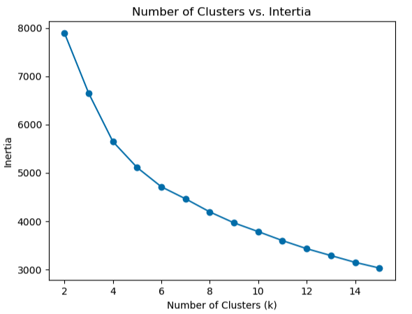
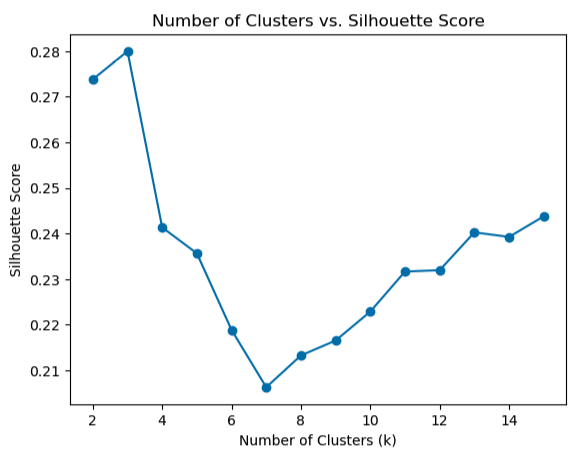
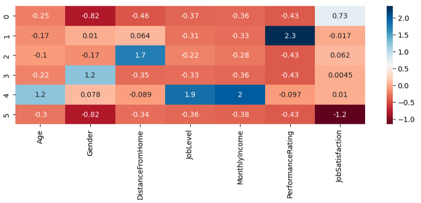
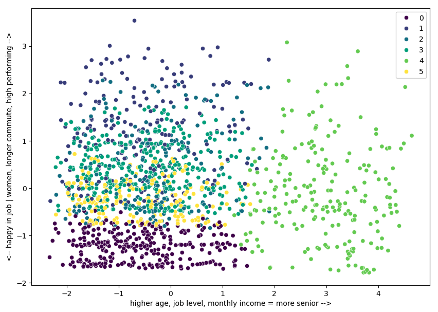

# unsupervised-machine-learning

**Employee Segmentation & Retention Analysis**
Used K-Means Clustering to segment employees based on demographic, job-related, and satisfaction factors, then applied PCA to visualize the resulting clusters. Each segment was linked to attrition data and broken down further by department, revealing hidden risk concentrations that shaped more targeted retention recommendations.
Tools: Python · Pandas · NumPy · Scikit-learn · Matplotlib · Seaborn

**Approach**
I started by segmenting employees using K-Means, based on demographic (age, gender), job-related (level, income, distance from home, performance), and satisfaction factors. Since these features have very different scales (income in thousands vs. satisfaction on a 1-5 scale), I standardized them first so no single variable would dominate the clustering just because of its numeric range.
To make sense of the resulting clusters visually, I reduced the data to two dimensions using PCA and plotted the clusters on that 2D projection.
The clustering itself only tells you that groups exist, not whether they matter. To find out, I added each employee's attrition status to their cluster assignment, using pd.concat() to attach the attrition column onto the cluster table. This let me calculate the actual attrition rate within each cluster, turning an abstract segmentation into a measurable retention risk.
Finally, I broke that attrition rate down further by department. A cluster's overall attrition rate can hide very different realities depending on where employees work, and that turned out to be the case here.
(Full preprocessing and cleaning code available upon request, see note at the bottom.)

**Determining the Number of Clusters**

The elbow method (inertia) suggests a good cluster count somewhere between 4 and 6, while the silhouette score peaks at k=3. Rather than following a single metric, k=6 was chosen because it activated two dimensions, commute distance and performance, that stayed near zero at lower cluster counts, and because it aligned well with the elbow curve's flattening point.

**Results**

Cluster Segmentation

Six employee segments emerged, each named after its dominant characteristic: senior employees, high performers, long commuters, female employees, men who like their jobs, and men who dislike their jobs.
Interpretation of the clusters 
cluster 0: junior satisfied male employees with low job level, low monthly income and long commute
cluster 1: high performing junior employees with low joblevel, low monthly income 
cluster 2: low performing employees with long commute, low job level and monthly income
cluster 3: low performing junior female employees with low job level, low monthly income, long commute
cluster 4: senior employees with high job level and monthly income 
cluster 5: unsatisfied and low performing junior male employees with low job level, low monthly income, long commute

Visualizing the Clusters with PCA

A PCA projection onto two principal components visualizes the cluster structure. PC1 primarily reflects seniority (age, job level, income), while PC2 contrasts gender, commute distance, and performance against job satisfaction. The senior group is clearly separated along PC1, while the remaining clusters overlap more, since their distinguishing factors are not dominant in PC1/PC2.

**Attrition Analysis**
Attrition Rate by Cluster
Bild anzeigen
Segmenting employees reveals sharp differences in attrition risk: out of the long commuters cluster, roughly 1 in 5 (21.8%) are leaving the company, compared to just 1 in 14 (7.3%) among senior employees.
Attrition Rate by Cluster and Department
Bild anzeigen
Breaking attrition down by department tells a more nuanced story. Long commuters in HR leave at a striking 66.7%, but the same cluster in R&D sits at just 15.4%. This pattern repeats across other at-risk clusters too: R&D consistently shows the lowest attrition among long commuters, employees who dislike their jobs, and female employees.
There's also a hidden risk worth flagging: female employees look only moderately at risk overall (15.5%), but that average hides a concentrated spike, 30% attrition within HR specifically, the second-highest single risk point in the entire dataset.

**Methodological Notes**
Why k=6 instead of k=4?
At k=4, distance from home and performance rating stayed close to zero across every cluster, meaning they weren't actually distinguishing anyone. Moving to k=6 activated both dimensions, surfacing two segments that hadn't existed before: long commuters and high performers, two groups that turned out to carry among the highest attrition risk in the dataset.

**Findings & Recommendations**
Higher attrition risk:
Long commuters, highest overall attrition (21.8%), concentrated almost entirely in HR (66.7%) and Sales (31.1%); R&D sits close to the company average (15.4%). Remote or hybrid options would likely help most in HR and Sales specifically, not company-wide.
Men who dislike their jobs, manager check-ins recommended, especially outside R&D.
High performers, create clearer paths to senior roles to retain ambitious employees.
Lower attrition risk (with one exception):
Senior employees, low attrition (7.3%), consistent with a group defined by high age, job level, and income.
Men who like their jobs, expected, satisfaction drives retention.
Female employees, moderate on average (15.5%), but attrition reaches 30% within HR specifically, the second-highest single risk point in the dataset. Worth investigating what's different about the HR environment for women specifically.
